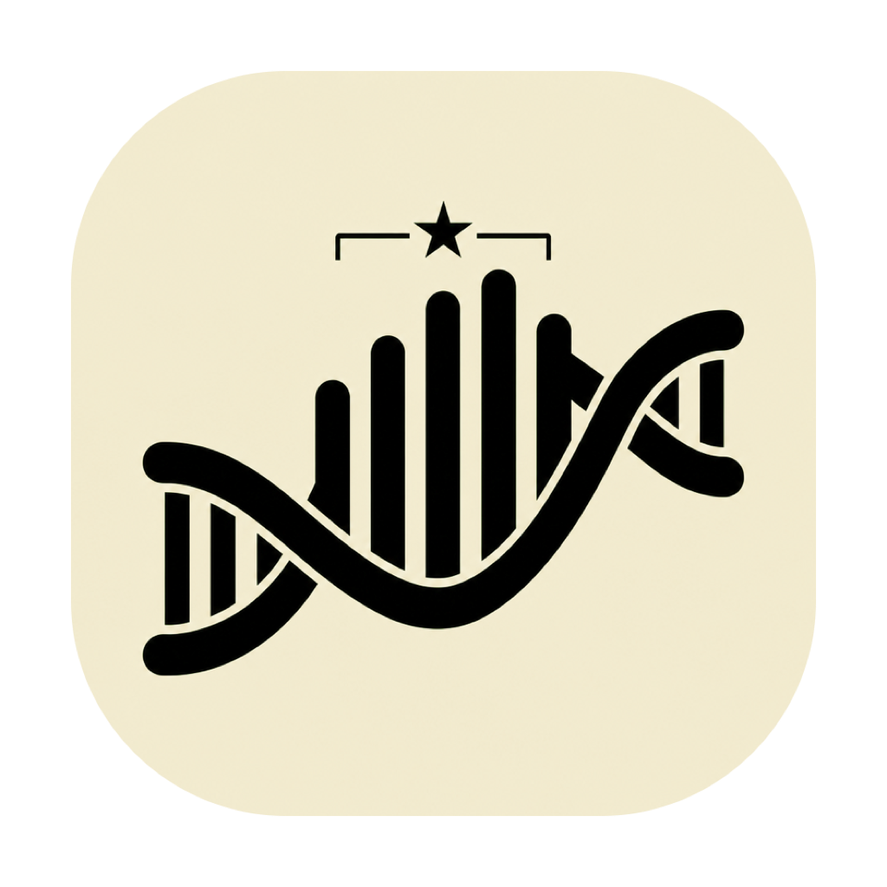

   
  

  <h1 style="font-size: 2.5rem; margin-top: 16px;">Helix</h1>

  <h3 style="font-weight: 600; margin-top: 8px;">Scientific data analysis, simplified.</h3>
  
  

    A free, minimalist, and private alternative to GraphPad Prism for macOS.
  

   

  

    <a href="https://helix-desktop.com">🌐 Website</a>
    &nbsp;•&nbsp;
    <a href="https://www.glaze.app/app/helix-nSaq7x">⚡ Download via Glaze</a>
  

   

